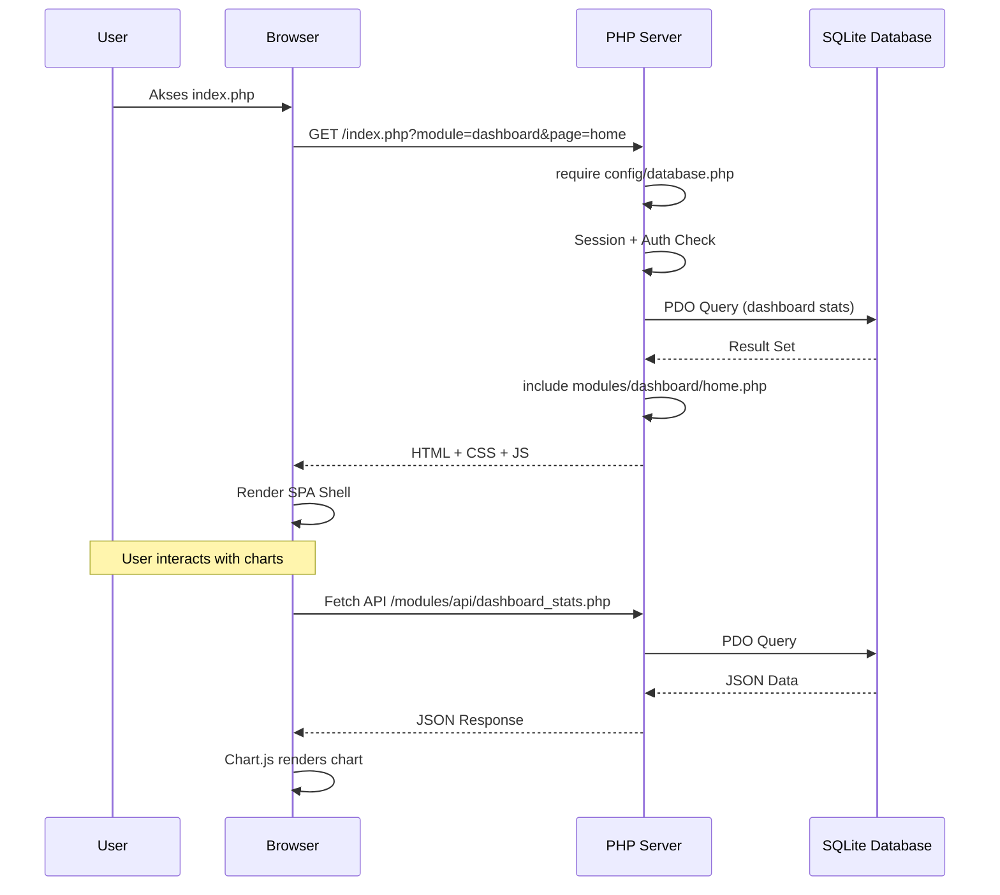
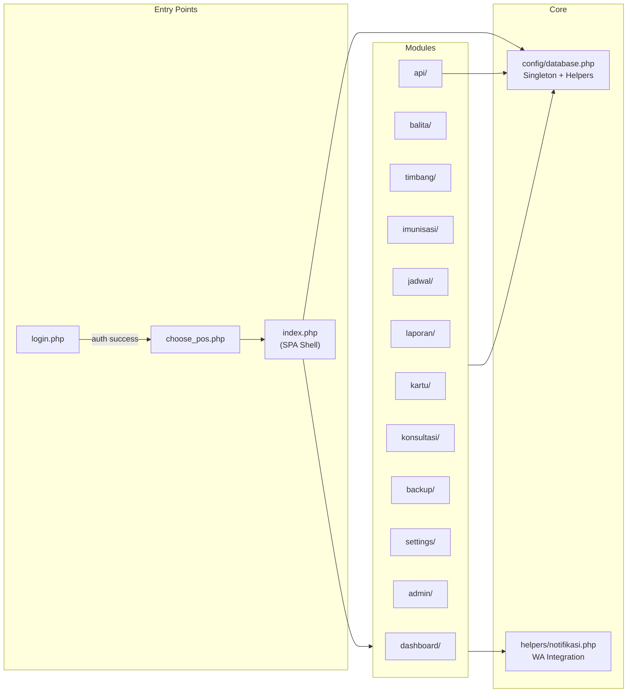
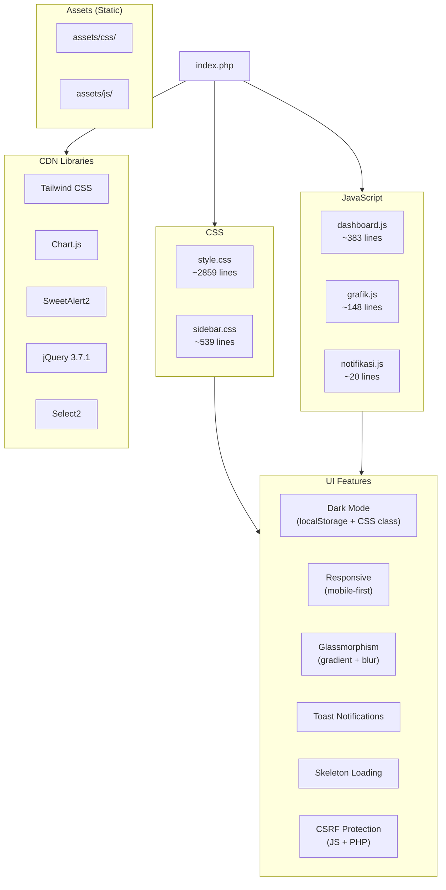
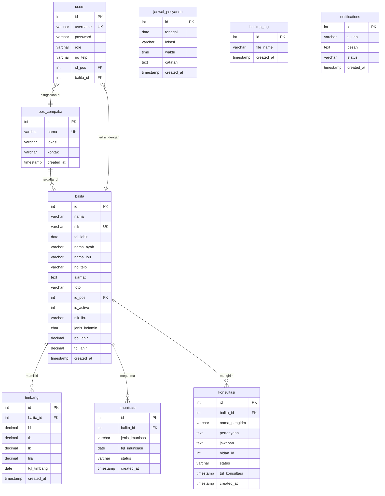
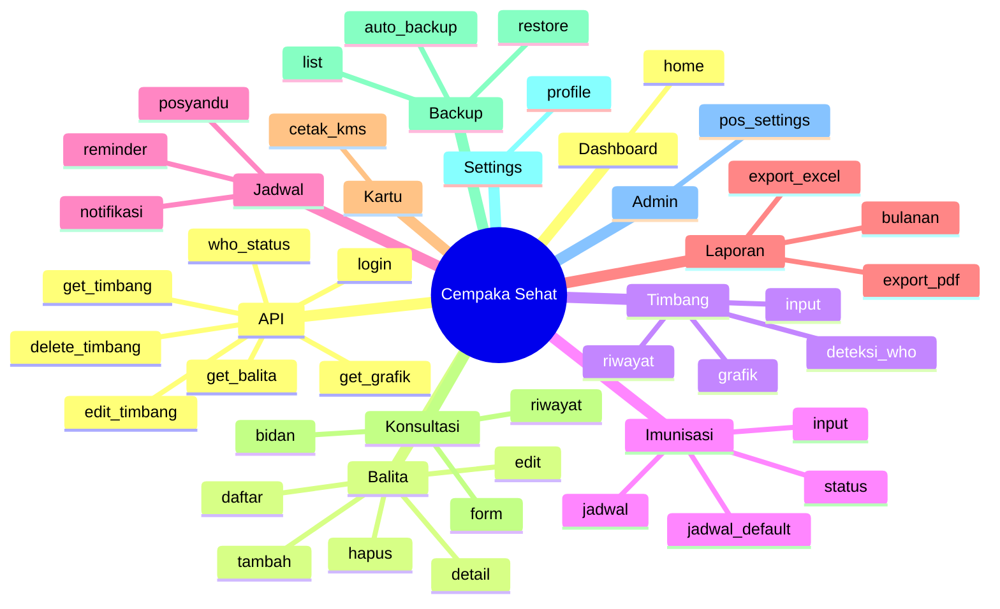
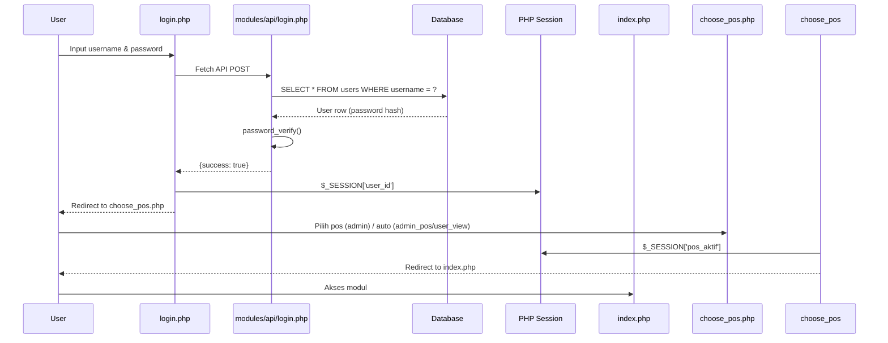
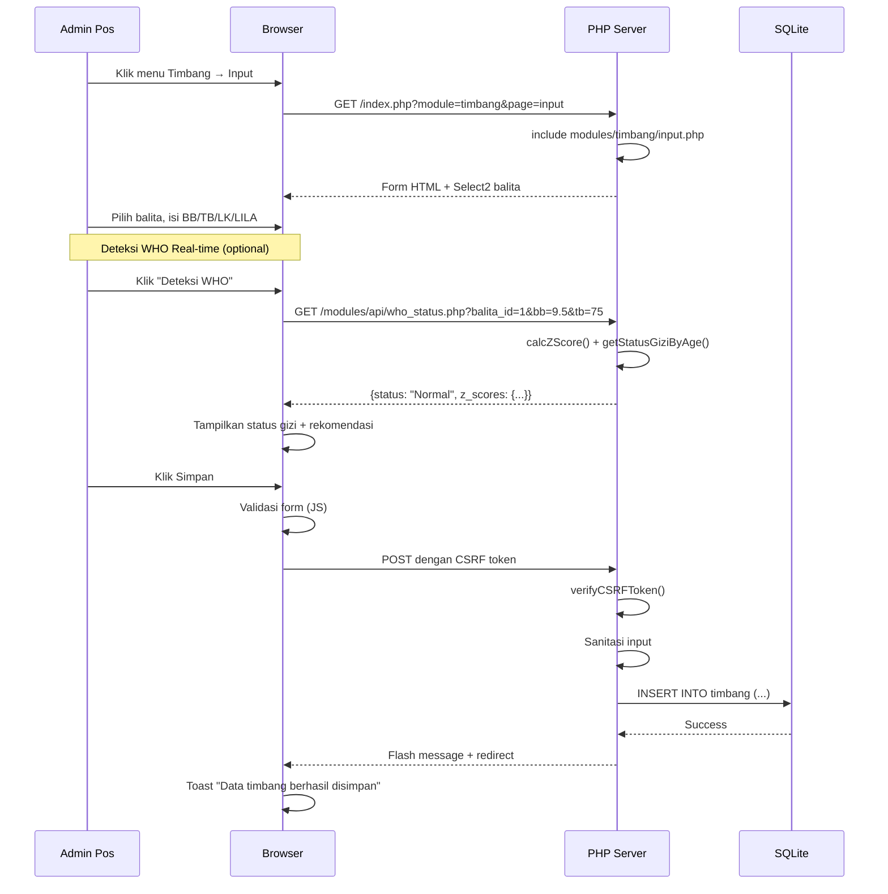
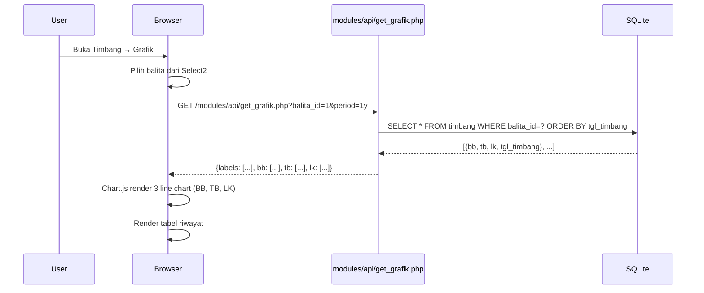

# Blueprint Sistem Informasi Posyandu "Cempaka Sehat"

> **Versi:** 1.0 | **Status:** Production Ready | **Update:** Juni 2026

---

## Daftar Isi

1. [Project Overview](#1-project-overview)
2. [Arsitektur Sistem](#2-arsitektur-sistem)
3. [Backend Architecture](#3-backend-architecture)
4. [Frontend Architecture](#4-frontend-architecture)
5. [Database Schema](#5-database-schema)
6. [Module Map](#6-module-map)
7. [API Endpoints](#7-api-endpoints)
8. [Authentication & Authorization](#8-authentication--authorization)
9. [Data Flow](#9-data-flow)
10. [Deployment](#10-deployment)

---

## 1. Project Overview

**Sistem Informasi Posyandu** adalah aplikasi web berbasis PHP untuk mengelola data tumbuh kembang balita di Posyandu. Digunakan oleh kader/administrator posyandu dan orang tua untuk memantau berat badan, tinggi badan, imunisasi, serta konsultasi dengan bidan.

### Tech Stack

| Layer | Teknologi | Versi / Sumber |
|-------|-----------|----------------|
| **Bahasa Backend** | PHP (Native, no framework) | 8.x |
| **Database** | SQLite (primer) / MySQL (legacy) | - |
| **Database Driver** | PDO | PHP 8.x |
| **CSS Framework** | Tailwind CSS | CDN (`cdn.tailwindcss.com`) |
| **CSS Kustom** | `style.css` + `sidebar.css` | ~3400 baris |
| **JavaScript** | Vanilla JS (ES6) | - |
| **Chart Library** | Chart.js | CDN |
| **UI Components** | SweetAlert2 | CDN |
| **Select UI** | Select2 + jQuery 3.7.1 | CDN |
| **Icons** | SVG Inline + Font Awesome | CDN |
| **Fonts** | Google Fonts (Poppins, Outfit, Quicksand) | CDN |

### Target Users

| Role | Level Akses | Deskripsi |
|------|-------------|-----------|
| **super_admin** | Full | Melihat semua pos, kelola pos, backup |
| **admin_pos** | Per Pos (1-5) | CRUD balita, timbang, imunisasi di posnya |
| **user_view** | Read-only (anak sendiri) | Melihat data anak sendiri saja |

---

## 2. Arsitektur Sistem

```mermaid
graph TB
    subgraph Browser["Browser Client"]
        UI["SPA Shell<br/>index.php"]
        CSS["Tailwind CDN<br/>+ Custom CSS"]
        JS["Vanilla JS<br/>+ Chart.js + Sweetalert2"]
    end

    subgraph Server["PHP Server (Apache/Nginx)"]
        ROUTER["index.php<br/>Routing via GET params"]
        AUTH["config/database.php<br/>Session Auth + CSRF"]
        MODULES["modules/<br/>(11 modules, ~30 pages)"]
        API["modules/api/<br/>(9 JSON endpoints)"]
    end

    subgraph Storage["Storage Layer"]
        DB[("SQLite<br/>database.sqlite")]
        BACKUPS["backups/<br/>*.sqlite"]
    end

    UI -->|include()| ROUTER
    ROUTER -->|module & page| MODULES
    MODULES -->|PDO| DB
    JS -->|Fetch API JSON| API
    API -->|PDO| DB
    MODULES -->|file copy| BACKUPS
```

### Alur Request



### Routing SPA

`index.php` sebagai SPA Shell. Routing dilakukan via parameter GET:

```
index.php?module={module}&page={page}
```

- `module` → folder di `modules/`
- `page` → file `.php` di dalam folder module

Contoh: `index.php?module=balita&page=daftar` → `include "modules/balita/daftar.php"`

---

## 3. Backend Architecture

### Struktur Backend



### Database Class (Singleton Pattern)

**File:** `config/database.php` (657 baris)

| Method | Fungsi |
|--------|--------|
| `getInstance()` | Singleton pattern |
| `query($sql, $params)` | Prepared statement execution |
| `select($sql, $params)` | Fetch all rows |
| `selectOne($sql, $params)` | Fetch single row |
| `insert($table, $data)` | Insert with named params |
| `update($table, $data, $where)` | Update with collision-safe params |
| `delete($table, $where)` | Delete with params |

### Global Helper Functions

| Function | Kegunaan |
|----------|----------|
| `db()` | Shortcut ke Database singleton |
| `isAdmin()` / `isAdminPos()` / `isUserView()` | Role check |
| `getPosFilter()` | SQL filter berdasarkan pos aktif |
| `getBalitaFilter()` | SQL filter berdasarkan role + pos |
| `getCurrentUser()` | Ambil data user dari session |
| `generateCSRFToken()` / `verifyCSRFToken()` | CSRF protection |
| `sanitize()` / `escape()` | Output / SQL sanitasi |
| `flash()` | Flash message session |
| `getVaksinMaster()` | Daftar 21 vaksin IDAI |
| `getWHORef()` | Referensi WHO Z-score (0-60 bln) |
| `calcZScore()` | Hitung Z-score individu |
| `getStatusGiziByAge()` | Status gizi lengkap (BB/U, TB/U, LK/U) |

### WHO Z-Score Calculator

Sistem memiliki implementasi **WHO Child Growth Standards** untuk anak usia 0-60 bulan:

- **Parameter:** BB (Berat Badan), TB (Tinggi Badan), LK (Lingkar Kepala), LILA
- **Z-Score:** `(value - median) / SD` dengan interpolasi linear
- **Output Status:** Normal, Underweight, Severely Underweight, Stunted, Severely Stunted, Overweight, Microcephaly Risk, Wasting Risk
- **Warna Indikator:** Merah (kritis), Kuning (warning), Biru (normal)

---

## 4. Frontend Architecture

### Struktur Frontend



### Tema & Dark Mode

- **Default:** Gradient blue/pink/violet
- **Dark Mode:** Toggle via `html` class, persisted di `localStorage`
- **Glassmorphism:** `backdrop-blur`, `bg-white/10`, `border-white/20`
- **Animasi:** Custom keyframes (fadeIn, slideInLeft, slideInRight, pulse-glow)

### Interaksi JS (dashboard.js)

| Fitur | Detail |
|-------|--------|
| Sidebar Accordion | Toggle dropdown dengan data-module |
| Mobile Menu | Sidebar slide + overlay |
| Dark Mode Toggle | localStorage + class toggle |
| User Dropdown | Hover-based dropdown |
| Toast System | Notifikasi sukses/error otomatis |
| Form Handling | AJAX submit + loading state |
| Confirmation | SweetAlert2 sebelum hapus |
| Keyboard Shortcuts | Shortcuts untuk navigasi cepat |
| Intersection Observer | Animasi scroll |

---

## 5. Database Schema

### Entity Relationship Diagram



### Detail Tabel

#### pos_cempaka
| Kolom | Tipe | Keterangan |
|-------|------|------------|
| id | INTEGER PK | Auto increment |
| nama | VARCHAR(100) | Nama pos (Cempaka I-V) |
| lokasi | VARCHAR(255) | Alamat pos |
| kontak | VARCHAR(20) | Nomor kontak |
| created_at | TIMESTAMP | Waktu dibuat |

#### balita
| Kolom | Tipe | Keterangan |
|-------|------|------------|
| id | INTEGER PK | Auto increment |
| nama | VARCHAR(100) | Nama balita |
| nik | VARCHAR(16) UNIQUE | NIK balita |
| tgl_lahir | DATE | Tanggal lahir |
| nama_ayah | VARCHAR(100) | Nama ayah |
| nama_ibu | VARCHAR(100) | Nama ibu |
| nik_ibu | VARCHAR(16) | NIK ibu (untuk user_view login) |
| no_telp | VARCHAR(15) | Nomor telepon orang tua |
| alamat | TEXT | Alamat rumah |
| foto | VARCHAR(255) | Path foto (nullable) |
| id_pos | INTEGER FK | Pos terdaftar (default 1) |
| is_active | INTEGER | Status aktif (1/0) |
| jenis_kelamin | CHAR(1) | L / P |
| bb_lahir | DECIMAL(5,2) | BB saat lahir (nullable) |
| tb_lahir | DECIMAL(5,2) | TB saat lahir (nullable) |

#### timbang
| Kolom | Tipe | Keterangan |
|-------|------|------------|
| id | INTEGER PK | Auto increment |
| balita_id | INTEGER FK | Relasi ke balita |
| bb | DECIMAL(5,2) | Berat badan (kg) |
| tb | DECIMAL(5,2) | Tinggi badan (cm) |
| lk | DECIMAL(5,2) | Lingkar kepala (cm) |
| lila | DECIMAL(5,2) | Lingkar lengan (cm) |
| tgl_timbang | DATE | Tanggal penimbangan |

#### users
| Kolom | Tipe | Keterangan |
|-------|------|------------|
| id | INTEGER PK | Auto increment |
| username | VARCHAR(50) UNIQUE | NIK ibu (user_view) / username (admin) |
| password | VARCHAR(255) | Bcrypt hash |
| role | VARCHAR(20) | super_admin / admin_pos / user_view |
| no_telp | VARCHAR(15) | Nomor HP (notifikasi WA) |
| id_pos | INTEGER FK | Pos ditugaskan (0 = all) |
| balita_id | INTEGER FK | Balita terkait (untuk user_view) |

#### imunisasi
| Kolom | Tipe | Keterangan |
|-------|------|------------|
| id | INTEGER PK | Auto increment |
| balita_id | INTEGER FK | Relasi ke balita |
| jenis_imunisasi | VARCHAR(100) | Nama vaksin |
| tgl_imunisasi | DATE | Tanggal pemberian |
| status | VARCHAR(20) | belum / sudah |

#### jadwal_posyandu
| Kolom | Tipe | Keterangan |
|-------|------|------------|
| id | INTEGER PK | Auto increment |
| tanggal | DATE | Hari posyandu |
| lokasi | VARCHAR(255) | Tempat |
| waktu | TIME | Jam pelaksanaan |
| catatan | TEXT | Informasi tambahan |

#### konsultasi
| Kolom | Tipe | Keterangan |
|-------|------|------------|
| id | INTEGER PK | Auto increment |
| balita_id | INTEGER FK | Balita terkait |
| nama_pengirim | VARCHAR(100) | Nama orang tua |
| pertanyaan | TEXT | Isi pertanyaan |
| jawaban | TEXT | Jawaban bidan (nullable) |
| bidan_id | INTEGER | ID bidan yang menjawab |
| tgl_konsultasi | TIMESTAMP | Waktu tanya |
| status | VARCHAR(20) | pending / answered |

#### backup_log
| Kolom | Tipe | Keterangan |
|-------|------|------------|
| id | INTEGER PK | Auto increment |
| file_name | VARCHAR(255) | Nama file backup |
| created_at | TIMESTAMP | Waktu backup |

#### notifications
| Kolom | Tipe | Keterangan |
|-------|------|------------|
| id | INTEGER PK | Auto increment |
| tujuan | VARCHAR(255) | Nomor WA tujuan |
| pesan | TEXT | Isi notifikasi |
| status | VARCHAR(20) | pending / sent / failed |

### Database: SQLite (Primer) vs MySQL (Legacy)

| Aspek | SQLite | MySQL |
|-------|--------|-------|
| **File** | `database.sqlite` | `schema.sql` |
| **Setup** | Auto-create via `initializeSchema()` | Manual import `schema.sql` |
| **Type** | File-based | Server-based |
| **Auto-increment** | `INTEGER PRIMARY KEY AUTOINCREMENT` | `INT PRIMARY KEY AUTO_INCREMENT` |
| **Boolean** | `INTEGER (1/0)` | `BOOLEAN` / `TINYINT` |
| **Enum** | `VARCHAR` + app logic | `ENUM()` native |
| **FK** | `FOREIGN KEY ... ON DELETE CASCADE` | Sama |

### Relasi Kunci

- **balita → pos_cempaka:** Many-to-One (setiap balita terdaftar di satu pos)
- **balita → timbang:** One-to-Many (satu balita bisa ditimbang berkali-kali)
- **balita → imunisasi:** One-to-Many (satu balita punya banyak imunisasi)
- **balita → konsultasi:** One-to-Many (satu balita bisa konsultasi berkali-kali)
- **users → balita:** Many-to-One (satu akun user_view terikat ke satu balita via `nik_ibu`)
- **users → pos_cempaka:** Many-to-One (admin_pos terikat ke satu pos)

---

## 6. Module Map



### Akses Menu per Role

| Modul | super_admin | admin_pos | user_view |
|-------|:-----------:|:---------:|:---------:|
| Dashboard | ✅ | ✅ | ✅ |
| Balita (daftar/tambah/edit/hapus) | ✅ | ✅ | ❌ |
| Balita (detail) | ✅ | ✅ | ✅ |
| Timbang (input/edit/hapus) | ✅ | ✅ | ❌ |
| Timbang (riwayat/grafik) | ✅ | ✅ | ✅ |
| Imunisasi (input) | ✅ | ✅ | ❌ |
| Imunisasi (jadwal/status) | ✅ | ✅ | ✅ |
| Jadwal Posyandu | ✅ | ✅ | ✅ |
| Laporan | ✅ | ❌ | ❌ |
| Kartu KMS | ✅ | ✅ | ✅ |
| Konsultasi (form/riwayat) | ✅ | ✅ | ✅ |
| Konsultasi (bidan) | ✅ | ✅ | ❌ |
| Backup | ✅ | ❌ | ❌ |
| Settings Profile | ✅ | ✅ | ✅ |
| Kelola Pos | ✅ | ❌ | ❌ |

---

## 7. API Endpoints

Semua endpoint ada di `modules/api/` dan mengembalikan response JSON.

| Endpoint | Method | Parameter | Response | Fungsi |
|----------|--------|-----------|----------|--------|
| `/modules/api/login.php` | POST | `username`, `password` | `{success, user, token}` | Login user |
| `/modules/api/get_balita.php` | GET | `q` (search) | `[{id, nama, nik, nama_ibu, ...}]` | Pencarian balita AJAX |
| `/modules/api/get_grafik.php` | GET | `balita_id`, `period` (3m/6m/1y/all) | `{labels[], bb[], tb[], lk[]}` | Data grafik pertumbuhan |
| `/modules/api/get_timbang.php` | GET | `id` | `{id, bb, tb, lk, lila, tgl_timbang}` | Detail satu record timbang |
| `/modules/api/edit_timbang.php` | POST | `id`, `bb`, `tb`, `lk`, `lila`, `tgl_timbang` | `{success}` | Update record timbang |
| `/modules/api/delete_timbang.php` | POST | `id` | `{success}` | Hapus record timbang |
| `/modules/api/who_status.php` | GET | `balita_id`, `bb`, `tb`, `lk`, `lila` | `{status, rekomendasi, color, bb_status, tb_status, z_scores}` | Deteksi WHO Z-score real-time |

---

## 8. Authentication & Authorization

### Alur Login



### Role-Based Access Control

1. **super_admin** — Bisa memilih pos via `choose_pos.php`, melihat data semua pos
2. **admin_pos** — `id_pos` diambil dari database, langsung diset ke session
3. **user_view** — Data difilter via `nik_ibu` (NIK ibu = username)

Filter SQL otomatis via fungsi `getPosFilter()` dan `getBalitaFilter()`:

```
super_admin + pos_aktif=2  → WHERE id_pos = 2
admin_pos + id_pos=3       → WHERE id_pos = 3
user_view                   → WHERE nik_ibu = 'NIK_IBU'
```

### Security Measures

| Aspek | Implementasi |
|-------|-------------|
| SQL Injection | Prepared statements (PDO) |
| XSS | `htmlspecialchars()` output sanitasi |
| CSRF | Token `bin2hex(random_bytes(32))` + `hash_equals()` |
| Password | `password_hash()` bcrypt |
| Session | PHP native session + `session_regenerate_id()` |
| File Access | `.htaccess` melindungi folder backup |

---

## 9. Data Flow

### Flow: Input Penimbangan (Timbang)



### Flow: Grafik Pertumbuhan



---

## 10. Deployment

### Persyaratan Sistem

| Komponen | Minimal | Rekomendasi |
|----------|---------|-------------|
| PHP | 8.0 | 8.2+ |
| Web Server | Apache / Nginx | Apache with mod_rewrite |
| Database | SQLite 3 | SQLite (built-in PHP) |
| Ekstensi PHP | PDO, SQLite3, mbstring | Sama |
| Browser | Chrome 90+, Firefox 90+ | Chrome/Edge terbaru |
| Storage | 50 MB | 100 MB |

### Cara Install

```bash
# 1. Clone atau copy folder PROJEK ke web server
# 2. Pastikan folder writable untuk database.sqlite
chmod 664 database.sqlite
chmod 775 backups/

# 3. Akses dari browser
# Database dan tabel akan auto-create saat pertama diakses

# 4. Login dengan akun default:
#   Super Admin: admin / password
#   Admin Pos:   cempaka1 / pos123 (s/d cempaka5)
#   User View:   (NIK balita) / password
```

### Catatan Deployment

- **Zero build step** — Semua CSS/JS via CDN, tidak perlu npm/composer
- **SQLite auto-initialize** — Database, tabel, dan data demo dibuat otomatis
- **.htaccess** — Sudah include rewrite rules + direktori protection
- **Backup** — Backup SQLite via menu Backup → otomatis ke folder `backups/`

---

## Riwayat Perbaikan

### Putaran 1 — Clean Code & Bug Fix (1 Juni 2026)

| # | Kategori | Perbaikan | Status |
|---|----------|-----------|--------|
| 1 | 🔴 Bug | Hapus `escape()` → `trim()` di 9 module files (double-escaping nama dengan apostrof) | ✅ |
| 2 | 🔴 Security | Tambah `requireLogin()` di 3 file export Excel/PDF | ✅ |
| 3 | 🔴 Bug | Fix Z-score API keys mismatch — tambah `bb_tb` dan `lila_u` | ✅ |
| 4 | 🟡 Bug | Fix tooltip grafik — `data.status[index].status` → `data.status[index]` | ✅ |
| 5 | 🟡 Bug | Fix error key di riwayat — `data.message` → `data.error` | ✅ |
| 6 | 🟡 Bug | Fix column mapping `jadwal_default.php` — tambah `tanggal` & `waktu` dari form | ✅ |
| 7 | 🟡 Bug | Hapus auto-delete jadwal lampau (hilang tiap load halaman) | ✅ |
| 8 | 🟡 Dead Code | Hapus 9 file + 3 fungsi mati + 4 variable mati | ✅ |
| 9 | 🟢 Minor | Fix image path PDF, seed data `nik_ibu`, hapus redundant ALTER TABLE | ✅ |

### Putaran 2 — Security & Final Cleanup (1 Juni 2026)

| # | Kategori | Perbaikan | Status |
|---|----------|-----------|--------|
| 1 | 🔴 Security | Fix grafik API path — dulu broken di subdirektori, sekarang pakai path absolut | ✅ |
| 2 | 🔴 Security | Tambah CSRF di form jadwal posyandu (add + edit) | ✅ |
| 3 | 🔴 Security | Tambah CSRF di choose_pos.php (POST pilih pos) | ✅ |
| 4 | 🔴 Security | auto_backup — dari GET langsung backup jadi POST + konfirmasi | ✅ |
| 5 | 🟡 Dead Code | Hapus `getUserBalita()`, `$userMenus` array, `$message` variable | ✅ |
| 6 | 🟡 Dead Code | Hapus 3 endpoint/file tidak dipakai (send_wa, dashboard_stats, data_timbang_bulanan) | ✅ |
| 7 | 🟢 Minor | Fix konsultasi form (auto-fill nama), tambah `created_at` di tabel users, fix label LILA | ✅ |

### Hasil Audit Final (1 Juni 2026)

- **44 file PHP** — 0 syntax error
- **12 file dead code** dihapus — 0 dampak ke fitur
- **54 query database** diverifikasi — semua kolom cocok dengan schema
- **7 API endpoint** diverifikasi — semua response key cocok dengan JavaScript consumer
- **Frontend ↔ Backend ↔ Database** — ✅ sinkron penuh

---

## Struktur Folder Lengkap

```
PROJEK/
├── index.php                 # SPA Shell (router + layout)
├── login.php                 # Halaman login
├── logout.php                # Logout + destroy session
├── choose_pos.php            # Pilih pos (multi-pos)
├── setup.php                 # Setup script
├── test_db.php               # Test koneksi database
├── database.sqlite           # Database SQLite
├── .htaccess                 # URL rewriting + security
├── .gitignore
├── README.md
├── Manual_Book_Cempaka_Sehat.txt
│
├── config/
│   └── database.php          # Database class + helper functions
│
├── helpers/
│   └── notifikasi.php        # WhatsApp integration (Fonnte)
│
├── assets/
│   ├── css/
│   │   ├── style.css         # Main stylesheet (~2859 baris)
│   │   └── sidebar.css       # Sidebar styles (~539 baris)
│   └── js/
│       └── dashboard.js      # UI interactions (~383 baris)
│   └── img/
│       └── logo_anak.png
│
├── api/
│   └── login.php             # Thin wrapper → modules/api/login.php
│
├── modules/
│   ├── api/                  # 7 JSON endpoints
│   │   ├── login.php
│   │   ├── get_balita.php
│   │   ├── get_grafik.php
│   │   ├── get_timbang.php
│   │   ├── edit_timbang.php
│   │   ├── delete_timbang.php
│   │   └── who_status.php
│   ├── dashboard/home.php
│   ├── balita/               # daftar, tambah, detail, edit, hapus
│   ├── timbang/              # input, riwayat, grafik, deteksi_who
│   ├── imunisasi/            # input, jadwal, jadwal_default, status
│   ├── jadwal/               # posyandu, notifikasi, reminder
│   ├── laporan/              # bulanan, export_excel, export_pdf
│   ├── kartu/cetak_kms.php
│   ├── konsultasi/           # form, bidan, riwayat
│   ├── backup/               # auto_backup, restore, list
│   ├── settings/profile.php
│   └── admin/pos_settings.php
│
└── backups/                  # SQLite backup files
    └── *.sqlite
```

---

## Akun Demo

| Role | Username | Password | Keterangan |
|------|----------|----------|------------|
| Super Admin | `admin` | `password` | Akses semua pos |
| Admin Pos | `cempaka1` | `pos123` | Pos Cempaka I |
| Admin Pos | `cempaka2` | `pos123` | Pos Cempaka II |
| Admin Pos | `cempaka3` | `pos123` | Pos Cempaka III |
| Admin Pos | `cempaka4` | `pos123` | Pos Cempaka IV |
| Admin Pos | `cempaka5` | `pos123` | Pos Cempaka V |
| User View | `1234567890123456` | `password` | Ibu balita (Ahmad Rahman) |
| User View | `1234567890123457` | `password` | Ibu balita (Fatimah Sari) |
| User View | `1234567890123458` | `password` | Ibu balita (Budi Santoso) |

---

> **Catatan:** Blueprint ini merepresentasikan kondisi aktual sistem pada Juni 2026. Semua komponen backend, frontend, database, dan API telah diverifikasi sinkron satu sama lain.
